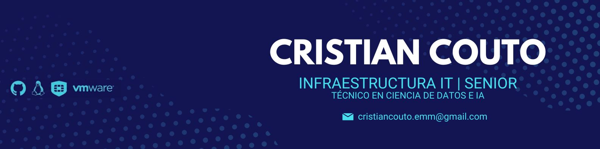

  

  *Transformando datos industriales en decisiones estratégicas*

---
### 👤 Sobre mí

Soy un **Administrador IT Senior** con más de 5 años de experiencia gestionando infraestructura crítica en entornos industriales de alta complejidad. Actualmente, estoy expandiendo la frontera de la eficiencia operativa mediante la **Ciencia de Datos y la Inteligencia Artificial**, uniendo el mundo físico de la planta con el potencial del análisis predictivo.

- 🔭 **Actualmente:** Liderando la infraestructura en **Solnik S.A.** para líneas de producción de Nokia, TV y Aire Acondicionado.
- 🎓 **Educación:** Técnico Superior en Ciencia de Datos e IA (Egresado 2025).
- ⚡ **Enfoque:** Reducir el *Downtime* mediante automatización y optimización basada en datos.

---

### 🛠️ Tecnologías & Herramientas

| Área | Tecnologías |
| :--- | :--- |
| **Data Science & IA** | Python, SQL, ETL, Modelos Predictivos, Análisis de Datos |
| **Infraestructura** | Windows Server, Active Directory, VMware (ESXi, vCenter), Redes Fortinet/HP/Aruba |
| **Resguardo & Storage** | Veeam Backup, ArcServe, Dell/Lenovo Servers, Storage IBM/QNAP |
| **Diseño Técnico** | AutoCAD 2D, SketchUp, Visio (Planos de Infraestructura y Redes) |
| **Soporte Industrial** | Scanners Honeywell, Impresoras SATO/Argox, CCTV IP (Hikvision/Dahua) |

---

### 📊 Estadísticas de GitHub

---

### 🚀 Logros Clave
* **Continuidad Operativa:** Gestión de infraestructura de misión crítica con respuesta inmediata ante incidentes en líneas Nokia.
* **Modernización:** Implementación de estrategias de Backup & DR (Disaster Recovery) para asegurar la integridad de datos industriales.
* **Visibilidad Técnica:** Diseño de planos detallados de racks y cableado estructurado, mejorando los tiempos de mantenimiento y escalabilidad.
* **Creación de Chatbot para la empresa "EL DORADO SRL".
* **Dashboard con Power Bi para "NEWSAN".
---

### 🤝 Conectemos
- [LinkedIn](https://www.linkedin.com/in/cristian-couto-147090211)
- 📧 [cristiancouto.emm@gmail.com]

---
*“En la intersección entre los servidores y los datos es donde ocurre la verdadera optimización industrial.”*
